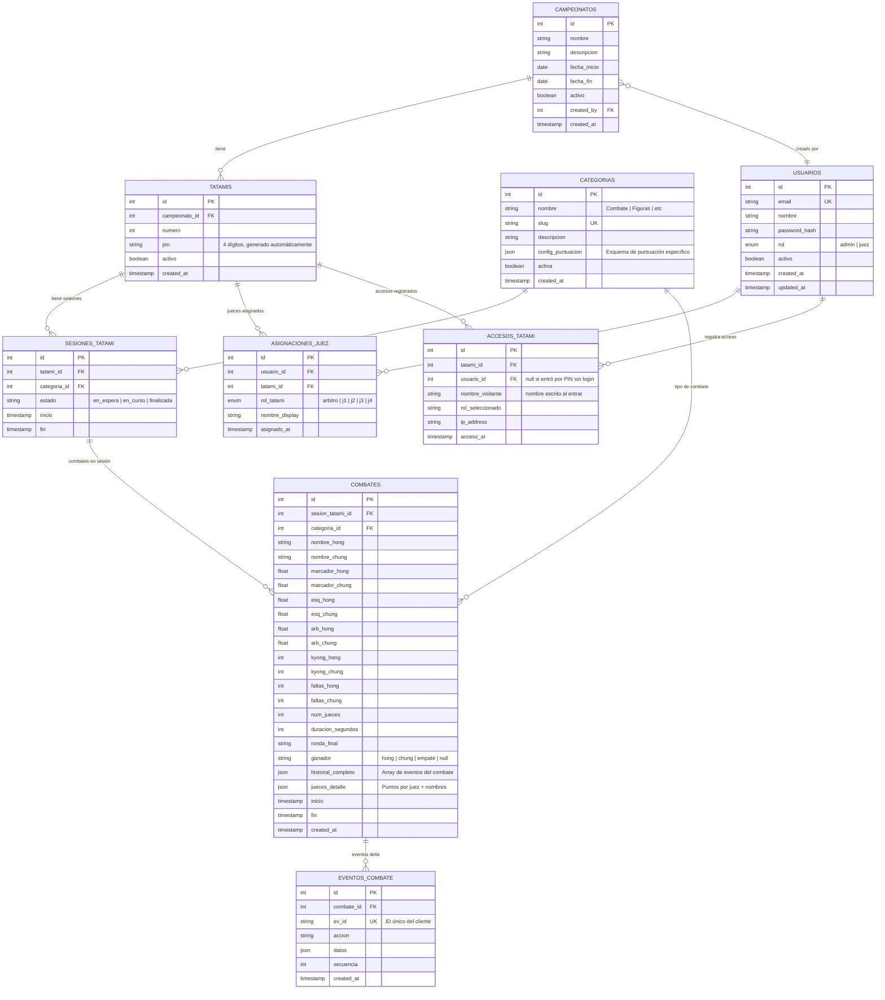
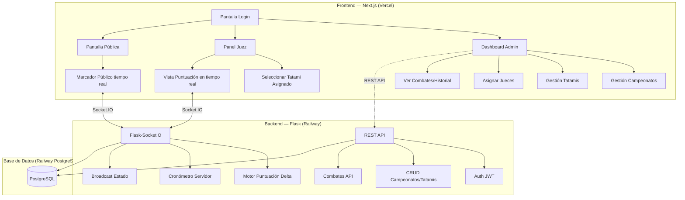
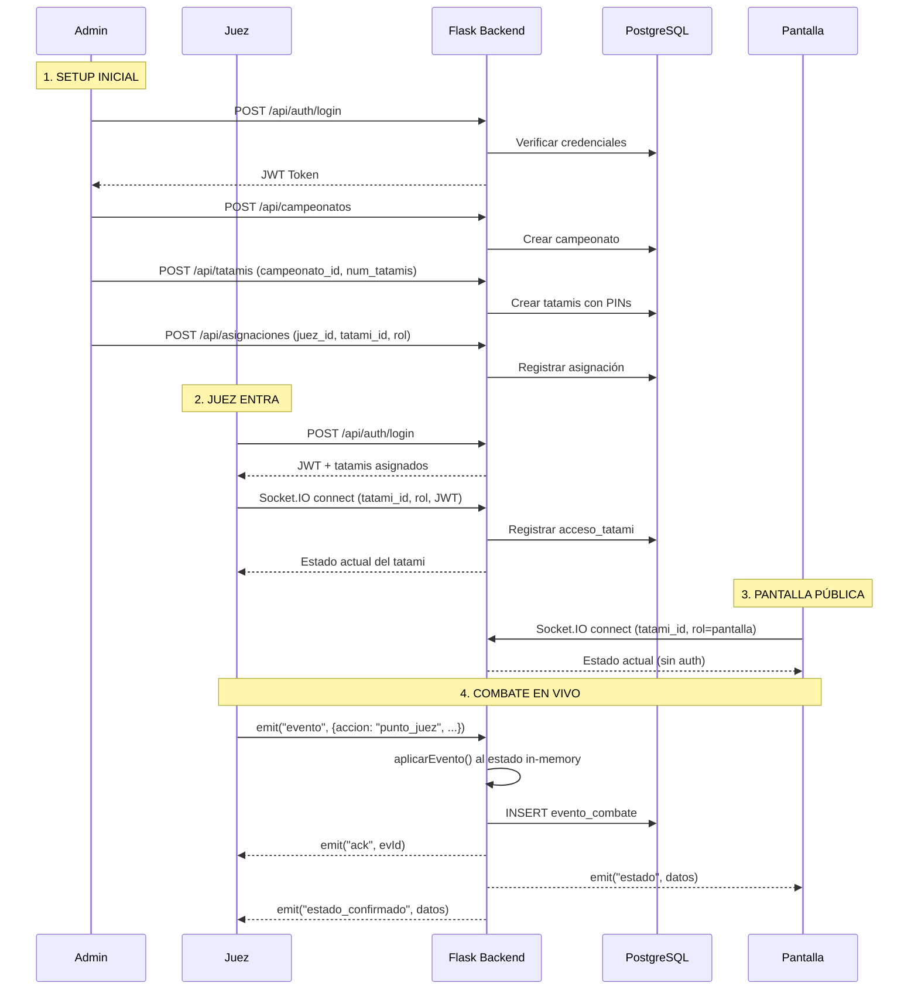
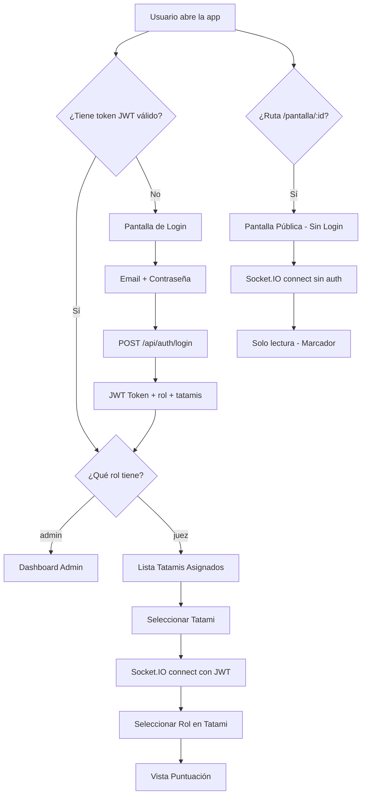

# DINAMYT v4 — Migración a Flask + Next.js + PostgreSQL

Transformar DINAMYT de una app monolítica Node.js (servidor + HTML/JS/CSS) a una arquitectura web moderna con backend Flask, frontend Next.js, base de datos PostgreSQL, autenticación, y soporte para múltiples categorías de competencia.

---

## User Review Required

> [!IMPORTANT]
> **Acceso a tatamis**: No seleccionaste esta opción. Propongo implementar un sistema **híbrido**:
> - El **Admin** asigna jueces a tatamis desde un panel.
> - **Cada tatami** genera un código PIN de 4 dígitos al ser creado.
> - Un juez puede acceder por **asignación directa** (ve sus tatamis asignados) o con el **PIN** del tatami (queda registrado con su nombre).
> - La **pantalla pública** no requiere login — solo necesita la URL del tatami.
>
> ¿Te parece bien este esquema híbrido? ¿O prefieres solo uno de los dos mecanismos?

> [!IMPORTANT]
> **Categorías futuras**: El plan incluye la tabla `categorias` y la columna `categoria_id` en los combates, pero **solo implementaremos la categoría "Combate"** por ahora. La infraestructura queda lista para añadir "Figuras" después con su propio sistema de puntuación. ¿Correcto?

> [!WARNING]
> **Clave de acceso actual**: El servidor actual tiene `CLAVE_ACCESO = 'Amy2026*'` hardcodeada. En la nueva versión esto se reemplaza con un sistema de login real con contraseñas hasheadas (bcrypt). ¿Quieres que el Admin inicial se cree con esa misma contraseña?

---

## Open Questions

> [!IMPORTANT]
> **Nombre del campeonato**: ¿El sistema debe soportar múltiples campeonatos simultáneos? Ejemplo: "Campeonato Nacional 2026" y "Copa Regional" corriendo al mismo tiempo, o ¿siempre habrá un solo campeonato activo?

> [!NOTE]
> **WebSocket legacy**: El código actual del frontend tiene ~1200 líneas de JS que manejan la lógica de puntuación, cronómetro, y rendering. En Next.js esto se va a dividir en componentes React. ¿Quieres conservar el proyecto actual (`dinamyt-server/`) tal cual como respaldo, o puedo reorganizar la carpeta?

---

## Modelo Relacional de Base de Datos



### Explicación de las tablas clave

| Tabla | Propósito |
|-------|-----------|
| `USUARIOS` | Login con email/contraseña. Roles: admin (gestiona todo) o juez (puntúa) |
| `CAMPEONATOS` | Agrupa tatamis bajo un campeonato. Un campeonato tiene fecha y estado |
| `CATEGORIAS` | **Extensible**: "Combate" (actual), "Figuras" (futuro). Cada una tiene su propio `config_puntuacion` (JSON) que define qué botones/puntos/reglas aplican |
| `TATAMIS` | Cada tatami tiene un PIN auto-generado. Pertenece a un campeonato |
| `SESIONES_TATAMI` | Vincula un tatami con una categoría activa (ej: tatami 1 ahora ejecuta "Combate") |
| `ASIGNACIONES_JUEZ` | Admin asigna un juez a un tatami con un rol específico (arbitro, j1, j2...) |
| `ACCESOS_TATAMI` | **Auditoría**: registra quién entró, cuándo, con qué IP, a qué tatami |
| `COMBATES` | Resultado final de cada combate (marcadores, ganador, historial completo como JSON) |
| `EVENTOS_COMBATE` | Cada acción delta durante un combate (para replay y auditoría) |

---

## Arquitectura del Sistema



### Flujo de la aplicación



---

## Proposed Changes

### Fase 1 — Backend Flask (Fundación)

---

#### [NEW] `DINAMYT-COMBAT/backend/`

Estructura completa del backend Python:

```
backend/
├── app/
│   ├── __init__.py          # Flask app factory
│   ├── config.py            # Configuración (DB URL, JWT secret, etc.)
│   ├── extensions.py        # SQLAlchemy, SocketIO, JWT, Migrate
│   ├── models/
│   │   ├── __init__.py
│   │   ├── usuario.py       # Modelo Usuario
│   │   ├── campeonato.py    # Modelo Campeonato
│   │   ├── categoria.py     # Modelo Categoría
│   │   ├── tatami.py        # Modelo Tatami + SesionTatami
│   │   ├── asignacion.py    # AsignacionJuez + AccesoTatami
│   │   └── combate.py       # Combate + EventoCombate
│   ├── api/
│   │   ├── __init__.py      # Blueprint registration
│   │   ├── auth.py          # /api/auth/login, /api/auth/register
│   │   ├── campeonatos.py   # CRUD campeonatos
│   │   ├── tatamis.py       # CRUD tatamis, PIN, asignaciones
│   │   ├── categorias.py    # CRUD categorías
│   │   └── combates.py      # Historial, resultados
│   ├── sockets/
│   │   ├── __init__.py
│   │   └── combate_ns.py    # Namespace Socket.IO /combate
│   ├── engine/
│   │   ├── __init__.py
│   │   └── combate_engine.py # Motor de puntuación (migrado del server.js actual)
│   └── seeds/
│       └── seed_categorias.py # Seed: categoría "Combate" + config_puntuacion
├── migrations/               # Alembic (via Flask-Migrate)
├── requirements.txt
├── run.py                    # Entry point
└── .env.example
```

**Archivos clave a implementar:**

- **`app/engine/combate_engine.py`** — Traducción directa de `aplicarEvento()` del [server.js](file:///d:/hapkido/DINAMYT-COMBAT/dinamyt-server/server.js#L114-L267) actual a Python. Este es el corazón del sistema: aplica eventos delta atómicamente.

- **`app/sockets/combate_ns.py`** — Reemplaza toda la lógica WebSocket de [server.js L440-L570](file:///d:/hapkido/DINAMYT-COMBAT/dinamyt-server/server.js#L440-L570). Usa rooms de Socket.IO (un room por tatami). Mantiene estado in-memory + persistencia en DB.

- **`app/api/auth.py`** — Login con JWT. Contraseñas hasheadas con bcrypt. Tokens con expiración de 24h.

- **`app/seeds/seed_categorias.py`** — Crea la categoría "Combate" con su `config_puntuacion`:
```json
{
  "tipo": "combate",
  "puntos_esquina": [
    {"nombre": "Golpe/Patada cuerpo", "pts": 1},
    {"nombre": "Giro cuerpo / Pat. cabeza", "pts": 2},
    {"nombre": "Giro a la cabeza", "pts": 3}
  ],
  "puntos_arbitro": [
    {"nombre": "Knock Down", "pts": 2},
    {"nombre": "Derribo/Barrida", "pts": 2},
    {"nombre": "Proyección", "pts": 2}
  ],
  "faltas": {
    "kyonggo": -0.5,
    "gamjeum": -1,
    "max_kyonggo_dq": 6,
    "max_gamjeum_dq": 3
  },
  "formula": "promedio_esquinas + arbitro",
  "alerta_diferencia": 12
}
```

---

### Fase 2 — Frontend Next.js

---

#### [NEW] `DINAMYT-COMBAT/frontend/`

```
frontend/
├── src/
│   ├── app/
│   │   ├── layout.tsx           # Root layout + providers
│   │   ├── page.tsx             # Landing → redirect a login
│   │   ├── login/
│   │   │   └── page.tsx         # Login form
│   │   ├── admin/
│   │   │   ├── layout.tsx       # Admin sidebar layout
│   │   │   ├── page.tsx         # Dashboard admin
│   │   │   ├── campeonatos/
│   │   │   │   └── page.tsx     # CRUD campeonatos
│   │   │   ├── tatamis/
│   │   │   │   └── page.tsx     # Gestión tatamis + PINs
│   │   │   ├── jueces/
│   │   │   │   └── page.tsx     # Asignar jueces a tatamis
│   │   │   └── historial/
│   │   │       └── page.tsx     # Combates guardados
│   │   ├── juez/
│   │   │   ├── page.tsx         # Lista de tatamis asignados
│   │   │   └── tatami/
│   │   │       └── [id]/
│   │   │           └── page.tsx # Vista de puntuación (j1-j4 o arbitro)
│   │   └── pantalla/
│   │       └── [tatami_id]/
│   │           └── page.tsx     # Pantalla pública (sin auth)
│   ├── components/
│   │   ├── ui/                  # Componentes UI reutilizables
│   │   ├── combate/
│   │   │   ├── JuezEsquinaView.tsx    # Migra vista-juez del HTML actual
│   │   │   ├── ArbitroView.tsx        # Migra vista-arbitro
│   │   │   ├── PantallaView.tsx       # Migra vista-pantalla (proyección)
│   │   │   ├── Cronometro.tsx         # Componente cronómetro
│   │   │   ├── MarcadorCompuesto.tsx  # Fórmula marcador
│   │   │   ├── HistorialAcciones.tsx  # Lista de acciones
│   │   │   └── AlertaOverlay.tsx      # Alerta 12pts, ganador, DQ
│   │   └── admin/
│   │       ├── CampeonatoForm.tsx
│   │       ├── TatamiGrid.tsx
│   │       └── JuezAssignment.tsx
│   ├── lib/
│   │   ├── api.ts               # Axios/fetch wrapper con JWT
│   │   ├── socket.ts            # Socket.IO client singleton
│   │   ├── auth.ts              # Auth context + hooks
│   │   └── combate-engine.ts    # Lógica local (optimistic updates)
│   ├── hooks/
│   │   ├── useCombate.ts        # Hook: estado del combate vía Socket.IO
│   │   ├── useAuth.ts           # Hook: autenticación
│   │   └── useTatami.ts         # Hook: datos del tatami
│   └── styles/
│       └── globals.css          # Migración del app.css actual
├── public/
├── next.config.ts
├── package.json
└── .env.local.example
```

**Componentes clave:**

- **`JuezEsquinaView.tsx`** — Migra la [vista-juez del HTML](file:///d:/hapkido/DINAMYT-COMBAT/dinamyt-server/index.html#L77-L152) y la lógica de [anotarJuez/deshacerJuez del JS](file:///d:/hapkido/DINAMYT-COMBAT/dinamyt-server/app.js#L552-L563) a un componente React con Socket.IO.

- **`ArbitroView.tsx`** — Migra la [vista-arbitro](file:///d:/hapkido/DINAMYT-COMBAT/dinamyt-server/index.html#L154-L399) con todas sus cards (cronómetro, marcador, puntos especiales, faltas, historial, combates guardados).

- **`PantallaView.tsx`** — Migra la [vista-pantalla](file:///d:/hapkido/DINAMYT-COMBAT/dinamyt-server/index.html#L401-L498) (pantalla de proyección para espectadores).

- **`useCombate.ts`** — Hook que reemplaza toda la lógica WebSocket del [app.js](file:///d:/hapkido/DINAMYT-COMBAT/dinamyt-server/app.js#L50-L127): conexión, reconexión, cola de eventos, ACK, optimistic updates.

---

### Fase 3 — Migración de la Lógica de Puntuación

---

La lógica del motor de combate actual vive en dos lugares:
1. **Servidor** ([server.js aplicarEvento](file:///d:/hapkido/DINAMYT-COMBAT/dinamyt-server/server.js#L114-L267)) — fuente de verdad
2. **Cliente** ([app.js aplicarEventoLocal](file:///d:/hapkido/DINAMYT-COMBAT/dinamyt-server/app.js#L395-L519)) — optimistic updates

Se migra así:

| Componente actual | Nuevo destino | Lenguaje |
|---|---|---|
| `server.js:aplicarEvento()` | `backend/app/engine/combate_engine.py` | Python |
| `server.js:crearTatami()` cronómetro | `backend/app/sockets/combate_ns.py` | Python |
| `app.js:aplicarEventoLocal()` | `frontend/src/lib/combate-engine.ts` | TypeScript |
| `app.js:enviarEvento()` + cola + ACK | `frontend/src/hooks/useCombate.ts` | TypeScript |
| `app.js:renderAll()` | Componentes React individuales | TypeScript/JSX |
| `app.css` | `frontend/src/styles/globals.css` | CSS |

---

### Fase 4 — Autenticación y Control de Acceso

---

#### Flujo de autenticación



#### Endpoints API REST

| Método | Ruta | Auth | Descripción |
|--------|------|------|-------------|
| `POST` | `/api/auth/login` | ❌ | Login → JWT |
| `POST` | `/api/auth/register` | Admin | Crear usuario (juez) |
| `GET` | `/api/campeonatos` | Admin | Listar campeonatos |
| `POST` | `/api/campeonatos` | Admin | Crear campeonato |
| `GET` | `/api/tatamis/:campeonato_id` | Auth | Listar tatamis |
| `POST` | `/api/tatamis` | Admin | Crear tatamis |
| `GET` | `/api/tatamis/:id/pin` | Admin | Ver PIN del tatami |
| `POST` | `/api/asignaciones` | Admin | Asignar juez a tatami |
| `GET` | `/api/mis-tatamis` | Juez | Tatamis asignados |
| `GET` | `/api/categorias` | Auth | Listar categorías |
| `GET` | `/api/combates/:tatami_id` | Auth | Historial combates |
| `GET` | `/api/combates/:id/detalle` | Auth | Detalle de un combate |

#### Socket.IO Events (namespace `/combate`)

| Evento | Dirección | Auth | Datos |
|--------|-----------|------|-------|
| `connect` | Client→Server | JWT (juez) o ninguno (pantalla) | `{tatami_id, rol}` |
| `evento` | Client→Server | JWT | `{evId, evento: {accion, ...}}` |
| `ack` | Server→Client | — | `{evId}` |
| `estado` | Server→Client (broadcast) | — | `{datos: {...}}` |
| `estado_confirmado` | Server→Client (emisor) | — | `{datos: {...}}` |
| `alerta12` | Server→Clients | — | `{hong, chung, lider}` |
| `ganador-flash` | Server→Clients | — | `{nombre, color, motivo}` |
| `falta-flash` | Server→Clients | — | `{ico, titulo, sub, tipo}` |
| `derrota` | Server→Clients | — | `{perdedor, razon}` |

---

### Fase 5 — Preparación para Despliegue

---

#### [NEW] `DINAMYT-COMBAT/docker-compose.yml`

Para desarrollo local con PostgreSQL containerizado:

```yaml
services:
  db:
    image: postgres:16
    environment:
      POSTGRES_DB: dinamyt
      POSTGRES_USER: dinamyt_user
      POSTGRES_PASSWORD: dinamyt_dev_2026
    ports:
      - "5432:5432"
    volumes:
      - pgdata:/var/lib/postgresql/data

  backend:
    build: ./backend
    ports:
      - "5000:5000"
    environment:
      DATABASE_URL: postgresql://dinamyt_user:dinamyt_dev_2026@db/dinamyt
      JWT_SECRET: dev-secret-key
    depends_on:
      - db

  frontend:
    build: ./frontend
    ports:
      - "3000:3000"
    environment:
      NEXT_PUBLIC_API_URL: http://localhost:5000
      NEXT_PUBLIC_SOCKET_URL: http://localhost:5000

volumes:
  pgdata:
```

#### Despliegue en producción

| Servicio | Plataforma | Detalle |
|----------|------------|---------|
| Frontend | **Vercel** | Deploy automático desde Git. Variables de entorno: `NEXT_PUBLIC_API_URL`, `NEXT_PUBLIC_SOCKET_URL` |
| Backend | **Railway** | Flask + Gunicorn + eventlet. Auto-deploy desde Git |
| PostgreSQL | **Railway** (addon) | PostgreSQL managed. URL inyectada automáticamente |
| Dominio | Opcional | Configurar dominio custom en Vercel + Railway |

#### [NEW] `DINAMYT-COMBAT/backend/Dockerfile`
#### [NEW] `DINAMYT-COMBAT/backend/Procfile` (para Railway)

```
web: gunicorn --worker-class eventlet -w 1 run:app --bind 0.0.0.0:$PORT
```

---

## Estructura Final del Proyecto

```
DINAMYT-COMBAT/
├── backend/                    # Flask API + Socket.IO
│   ├── app/
│   │   ├── __init__.py
│   │   ├── config.py
│   │   ├── extensions.py
│   │   ├── models/
│   │   ├── api/
│   │   ├── sockets/
│   │   ├── engine/
│   │   └── seeds/
│   ├── migrations/
│   ├── requirements.txt
│   ├── run.py
│   ├── Dockerfile
│   ├── Procfile
│   └── .env.example
│
├── frontend/                   # Next.js
│   ├── src/
│   │   ├── app/
│   │   ├── components/
│   │   ├── lib/
│   │   ├── hooks/
│   │   └── styles/
│   ├── package.json
│   └── .env.local.example
│
├── dinamyt-server/             # ← Proyecto original (respaldo)
│
├── docker-compose.yml          # Dev local
└── README.md                   # Documentación actualizada
```

---

## Verification Plan

### Automated Tests

1. **Backend**: Tests con `pytest`
   - Test de autenticación (login, JWT, roles)
   - Test del motor de puntuación (`combate_engine.py`) — verificar que `aplicarEvento()` produce los mismos resultados que el JS original
   - Test de Socket.IO (conexión, eventos delta, ACK)
   - Test de API REST (CRUD campeonatos, tatamis, asignaciones)

2. **Frontend**: Verificación visual con el browser tool
   - Login flow
   - Dashboard admin: crear campeonato, tatamis, asignar jueces
   - Vista juez: puntuación en tiempo real
   - Pantalla pública: marcador en tiempo real

3. **Integración**: Docker compose up → probar flujo completo

### Manual Verification
- Abrir múltiples pestañas simulando juez 1-4, árbitro y pantalla
- Verificar que los puntos se sincronizan en tiempo real
- Verificar reconexión automática
- Verificar persistencia en DB

---

## Orden de Ejecución

| # | Fase | Prioridad | Dependencias |
|---|------|-----------|--------------|
| 1 | Backend: Modelos + Migraciones + Seed categorías | 🔴 Alta | PostgreSQL instalado o Docker |
| 2 | Backend: Auth API (login, JWT, roles) | 🔴 Alta | Fase 1 |
| 3 | Backend: Motor de Combate + Socket.IO | 🔴 Alta | Fase 1, 2 |
| 4 | Backend: API REST (campeonatos, tatamis, asignaciones) | 🟡 Media | Fase 1, 2 |
| 5 | Frontend: Setup Next.js + Auth + Login | 🔴 Alta | Fase 2 |
| 6 | Frontend: Vistas de Combate (juez, árbitro, pantalla) | 🔴 Alta | Fase 3, 5 |
| 7 | Frontend: Dashboard Admin | 🟡 Media | Fase 4, 5 |
| 8 | Docker + Despliegue | 🟢 Baja | Todo lo anterior |
